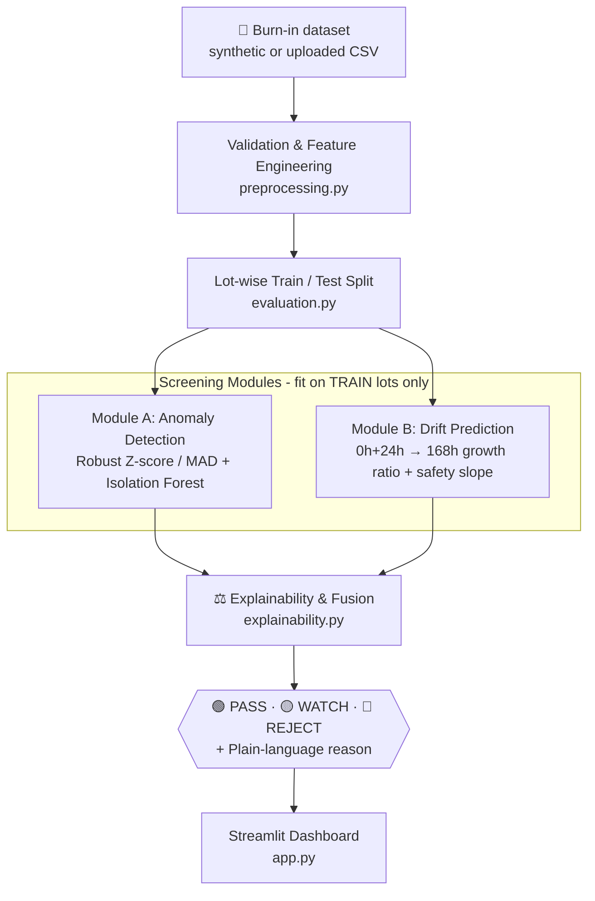

<div align="center">

# 🛰️ Burn-In Anomaly Detection

### AI-Driven Screening for Component Burn-In

**Don't just ask if a part crossed the line. Ask if it behaves like its own lot, and where it's headed.**

[](#-smart-india-hackathon-2026)
[](#-smart-india-hackathon-2026)
[](#-technology-stack)
[](#-technology-stack)
[](#-technology-stack)
[](#-technology-stack)
[](#-prototype-status)

> ### ⚠️ Synthetic demonstration dataset: **NOT official ISRO data**
> ### ⚠️ Prototype statistical safety criterion: **NOT an official ISRO limit**
> These two labels appear throughout the app itself. They are repeated here because they matter more than anything else in this README.

</div>

---

## 📌 At a Glance

| | |
|---|---|
| **What it is** | An AI-assisted QA screening assistant that flags anomalous components during burn-in, **before** the full 168-hour test finishes |
| **Core idea** | **Lot-relative screening**: judge a part against its own manufacturing lot and its own trajectory, not only against a fixed datasheet limit |
| **Output** | 🟢 PASS · 🟡 WATCH · 🔴 REJECT, with plain-language reasons a QA inspector can act on |
| **Who it helps** | Burn-in and screening QA engineers |
| **Hackathon** | Smart India Hackathon 2026 · Problem Statement **SIH26170** · ISRO / Department of Space |
| **Data** | Fully synthetic, clearly labelled as such everywhere in the UI |
| **Try it** | `streamlit run app.py`, then click **Load Demo Scenario** |

---

## 🚨 The Problem

Burn-in screening exposes components to stress to weed out early failures. But static screening only asks one question: *"Did this reading cross a fixed line?"*

That misses two kinds of dangerous parts:

| Hidden risk | Why static limits miss it |
|---|---|
| 🎯 **Lot-relative outlier** | Reads comfortably under the datasheet limit, but sits 2-3x above its own lot's median from the very start |
| 🐌 **Latent drifter** | Looks almost normal at 0h and 24h, then escalates sharply by 168h |

**A part can pass the datasheet and still be the odd one out.** In this domain a false negative (a defective part that slips through) is the costly mistake, so that's the metric this prototype optimises.

---

## 💡 Our Solution: Lot-Relative Screening + Early Drift Forecasting

The system asks two questions together:

```text
"Does this part behave like the rest of its own lot?"     →  Module A: Anomaly Detection
                          +
"Where is this part headed by 168h?"                      →  Module B: Drift Prediction
                          ↓
        PASS / WATCH / REJECT with a plain-language reason
```

### How this differs from static screening

| | Static datasheet screening | **This prototype** |
|---|---|---|
| Main question | Did the reading cross a fixed limit? | Is this part normal **for its lot**, and is it **drifting abnormally**? |
| Reference point | One number on a datasheet | The lot's own live median / MAD |
| Handles a part that is "in spec" but far from peers | Waves it through | **Flags it** (Module A) |
| Handles a slow early rise | Only visible after 168h | **Forecasts it from 0h/24h readings** (Module B) |
| Decision basis | A single threshold | Fusion of two independent modules |
| Output to the user | Pass / fail | Decision, numbers and a specific explanation |
| Datasheet limit | Sole criterion | Still enforced, as an additional check rather than a replacement |

---

## 🎬 Demo Walkthrough (≈ 3 minutes)

> Run the app locally and click **Load Demo Scenario** in the sidebar.

| Step | Action | What to notice |
|---|---|---|
| **1** | **Load Demo Scenario** | Generates the standard 14-lot synthetic dataset (fixed seed, reproducible) and makes the lot-wise train/test split |
| **2** | **Open QA Decisions** | Three CASE A/B/C parts are pinned and expanded. They sit in the *first held-out test lot*, so they're scored by models that never saw their lot in training |
| **3** | **Read CASE A** | Under the datasheet limit at every checkpoint, but ~2-3x its lot median from t=0 |
| **4** | **Read CASE B** | Looks fine at 24h, but the early forecast projects a sharp rise |
| **5** | **Read CASE C** | An ordinary part: both modules stay quiet |
| **6** | **Open Model Performance** | Recall / FNR on held-out lots, confusion matrix, and 168h MAE against a linear baseline |

**The three demo scenarios**

| Case | What it looks like | Who catches it | Decision |
|---|---|---|---|
| 🅰️ **CASE A** | Well under datasheet limit, but ~2-3x its lot's median from t=0 onward | Module A (robust Z-score). Module B stays quiet, since the part isn't drifting abnormally, it's just far from its peers | 🔴 **REJECT** |
| 🅱️ **CASE B** | An 8-10% early rise by 24h, plausible enough for a human skimming raw numbers to wave through, then a sharp escalation by 168h | Module B, using only 0h/24h readings, before the 168h data would even exist | 🔴 **REJECT** |
| 🅲 **CASE C** | An unremarkable, normal part | Neither module | 🟢 **PASS** |

---

## ✨ Key Features

### 📊 Module A: Lot-Relative Anomaly Detection
Robust Z-score using median/MAD, computed per lot and per checkpoint (primary, explainable), plus an **Isolation Forest** over lot-normalised multi-checkpoint ratios as a multivariate backstop. Both fuse into one 0-1 risk score via a transparent weighted-max.

### 📈 Module B: Early Drift Prediction
Predicts the **relative growth ratio** from 24h to 168h using only the 0h and 24h readings. Uses XGBoost (with an automatic `HistGradientBoostingRegressor` fallback) against a linear-regression baseline, and compares projected drift with a per-parameter-type safety slope.

### ⚖️ Explainable Decision Fusion
Combines both modules' 0-1 scores into PASS / WATCH / REJECT, **biased toward recall**: a strong single-module flag is never diluted away by the other module looking calm.

### 🗣️ Plain-Language Explanations
Every decision renders as a specific sentence citing the actual reading, the lot median, the robust Z-score or projected drift rate, and the threshold used, not a raw model score.

### 🧪 Honest Evaluation
Whole lots go to train or test (never individual rows). Metrics are reported on **held-out test lots only**; train-lot metrics are shown separately, labelled optimistic, so the generalisation gap stays visible.

### 🛡️ Robust Edge-Case Handling
Tiny lots, zero MAD, missing values, duplicate IDs, malformed uploads and missing XGBoost are all handled with clear messages instead of crashes.

---

## 🏗️ System Architecture



**Design principles**

- **Explainable by default**: every decision ships with the numbers and sentence that caused it
- **No single point of trust**: two independent modules are combined; neither is treated as ground truth
- **Recall first**: false negatives are the metric that matters, so anything flagged strongly is surfaced
- **Human in the loop**: the system recommends review, the QA inspector decides
- **Testable**: `pipeline.py` has no Streamlit dependency, so the full flow can be smoke-tested from a plain script

---

## 🔄 How It Works

1. **Validate**: schema, NaN and non-positive checks, duplicate handling, small-lot warnings
2. **Engineer features**: deltas, early slope, lot-relative robust Z per checkpoint, parameter-type dummies
3. **Split by lot**: whole lots go to train or test, never individual rows
4. **Fit on TRAIN lots only**: Isolation Forest, the drift regressor and the safety slope
5. **Score TRAIN and TEST**: Module A and Module B each produce a 0-1 risk score
6. **Fuse and explain**: recall-biased PASS / WATCH / REJECT with a plain-language reason
7. **Evaluate on TEST only**: classification and regression metrics on lots the models never saw

---

## 🧩 Module Reference

| File | Responsibility |
|---|---|
| `data_generator.py` | Builds the labelled synthetic dataset (normal / lot-relative outlier / latent drifter populations, lot-to-lot process variation, measurement noise). `inject_demo_cases()` deterministically overwrites 3 rows of a chosen lot with the CASE A/B/C scenarios |
| `preprocessing.py` | `validate_dataset()`, `compute_lot_stats()` (per-lot median/MAD with a population-level fallback for tiny lots), `engineer_features()` |
| `anomaly_detection.py` | **Module A.** Robust Z-score/MAD per lot per checkpoint + Isolation Forest fit on training lots only, fused into one 0-1 risk score by a transparent weighted-max |
| `drift_prediction.py` | **Module B.** Engineers `Value_0h`, `Value_24h`, deltas, robust-Z, datasheet-limit ratios and parameter-type dummies. Predicts the *relative growth ratio* (24h → 168h) with XGBoost or `HistGradientBoostingRegressor`, plus a linear baseline. Safety slope = `median + 3*MAD` of the training lots' relative drift rates, per parameter type |
| `evaluation.py` | `split_by_lot()`, `evaluate_classification()`, `evaluate_regression()`, both guarding degenerate cases instead of throwing |
| `explainability.py` | Turns Module A/B numbers into plain-language QA sentences and fuses both scores into PASS / WATCH / REJECT |
| `pipeline.py` | `run_pipeline()`: validate → features → lot-wise split → fit on TRAIN → score → evaluate on TEST. Returns one `PipelineResult` dataclass for the UI |
| `app.py` | Streamlit UI: Dashboard, Dataset, Lot Analysis, Anomaly Detection, Drift Prediction, QA Decisions (with pinned Demo Scenario), Model Performance |

---

## 🛠️ Technology Stack

| Layer | Technologies |
|---|---|
| **Language** | Python |
| **Dashboard** | Streamlit |
| **Anomaly detection** | Robust Z-score / MAD · scikit-learn Isolation Forest |
| **Drift prediction** | XGBoost (fallback: `HistGradientBoostingRegressor`) · linear-regression baseline |
| **Data** | Synthetic generator · CSV export from the app |

---

## 🧮 Modelled Parameters

Three parameter types are modelled, each with its own nominal baseline, datasheet limit and noise level, loosely representative of real magnitudes but **not sourced from a real qualified part**.

| Parameter | Unit |
|---|---|
| `leakage_current_uA` | µA |
| `iddq_current_uA` | µA |
| `propagation_delay_ns` | ns |

---

## 📊 Prototype Status

| Component | Status |
|---|---|
| Streamlit dashboard (7 pages) | ✅ Working prototype |
| Synthetic dataset generator | ✅ Available |
| Demo scenario (CASE A/B/C) | ✅ Available |
| Module A: robust Z-score + Isolation Forest | ✅ Available |
| Module B: early drift prediction | ✅ Available |
| Lot-wise held-out evaluation | ✅ Available |
| Plain-language explanations | ✅ Available |
| Edge-case handling | ✅ Tested |
| Validation on real burn-in logs | 🔬 Next step (no official dataset exists) |
| Human-in-the-loop review workflow | 🔮 Future |
| Parameter-specific, engineering-approved safety slopes | 🔮 Future |

---

## 📈 Results at a Glance

Reported on **held-out test lots only**, across the random splits run in development.

| Metric | Result | Note |
|---|---|---|
| **Recall / FNR** | 100% recall, zero false negatives on every test split run | Deliberate, recall-biased design |
| **Precision** | Moderate, typically 30-55% | A trade-off: over-flag for human review rather than let a defect through |
| **168h MAE** | Gradient boosting beat the linear baseline on every held-out split tested | After the relative-ratio fix (see [Bugs Fixed](#-bugs-found-and-fixed-during-development)) |

---

## 🚀 Getting Started

### Prerequisites

- Python ≥ 3.10

### 1. Enter the project

```bash
cd sih26170
```

### 2. Create a virtual environment *(optional but recommended)*

```bash
python -m venv .venv
source .venv/bin/activate      # macOS / Linux
# .venv\Scripts\activate       # Windows
```

### 3. Install dependencies

```bash
pip install -r requirements.txt
```

### 4. Run the app

```bash
streamlit run app.py
```

Open the URL Streamlit prints (typically `http://localhost:8501`), then click **Load Demo Scenario**.

> If `xgboost` fails to install, delete that line from `requirements.txt` and reinstall. The app detects its absence at import time and falls back to `HistGradientBoostingRegressor`, labelling whichever model was used on the **Drift Prediction** page.

---

## 📂 Project Structure

```text
sih26170/
│
├── app.py                      # Streamlit dashboard (entry point)
├── data/                       # Created on first CSV export from the app
├── src/
│   ├── __init__.py
│   ├── data_generator.py       # Synthetic dataset generator + demo-case injector
│   ├── preprocessing.py        # Validation, lot-wise statistics, feature engineering
│   ├── anomaly_detection.py    # Module A: robust Z-score/MAD + Isolation Forest
│   ├── drift_prediction.py     # Module B: 0h+24h → 168h regression + safety slope
│   ├── evaluation.py           # Lot-wise split + classification/regression metrics
│   ├── explainability.py       # Plain-language explanations + PASS/WATCH/REJECT fusion
│   └── pipeline.py             # Orchestrates the whole flow (no Streamlit dependency)
├── requirements.txt
└── README.md
```

`pipeline.py` is one small addition beyond the originally sketched structure. It exists so the entire ML pipeline can be imported and smoke-tested from a plain Python script. That's what made it possible to catch and fix several real bugs before they reached the UI.

---

## 📐 Key Assumptions

- **No official SIH26170 dataset exists.** The PS's own Dataset Link field is blank. Every row is synthetic and labelled as such in the UI.
- **Latent-defect parts are built to look statistically close to normal at 0h/24h** and diverge only later, so catching them early is a genuinely hard, honest test of Module B, not a rigged demo.
- **The regression target is the relative (fractional) growth ratio**, not the absolute 168h value, and the safety slope is derived **per parameter type** in the same units. This was a deliberate fix after testing (see below).
- **Sample weighting:** labelled anomalous training rows get 6x weight to reduce false negatives, matching the PS's emphasis. This only works because the synthetic data carries labels; a real deployment without ground truth would need a different signal (e.g. Module A's own anomaly score).
- **Evaluation is always on held-out test lots.** Train-lot metrics are shown separately, labelled optimistic.

---

## 🔮 Roadmap

| Phase | Focus |
|---|---|
| **Now** | Prototype: synthetic data, lot-relative anomaly detection, early drift forecast, explainable decisions |
| **Next** | Validate the generator's assumptions against real historical burn-in logs |
| **Then** | Human-in-the-loop review workflow for WATCH / REJECT items |
| **Scale** | Parameter-specific safety-slope percentiles signed off by reliability engineering |
| **Reach** | Continuous lot statistics for new part types as same-type history accumulates |

---

## 🎓 Smart India Hackathon 2026

**Problem Statement: SIH26170**
*AI-Driven Anomaly Detection in Component Burn-In & Screening* · ISRO / Department of Space

This prototype addresses the PS by combining lot-relative anomaly detection with early drift forecasting, helping QA teams recognise risky components:

- 🎯 Parts that are "in spec" but far from their own lot
- 🐌 Parts that look normal early and drift badly later
- ⏱️ Before the full 168-hour burn-in has finished

---

## ⚠️ Disclaimer

This is a research and hackathon prototype running on a **synthetic dataset that is not official ISRO data**. The safety slope is a **prototype statistical criterion, not an official ISRO limit**. Results are statistical risk signals, not predictions of a specific physical failure or mission outcome, and should be reviewed by a qualified QA engineer.

---

<div align="center">

### Burn-In Anomaly Detection: Screen against the lot, not just the limit.

**Smart India Hackathon 2026 · SIH26170**

*Built to catch the parts a fixed line would miss.*

</div>
